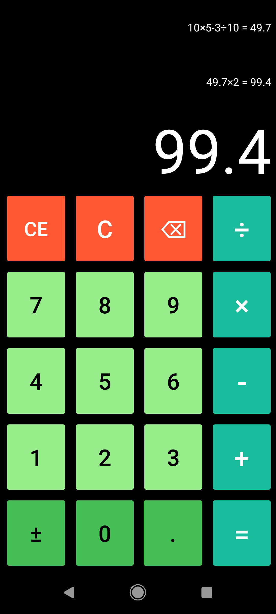

# Chess 
Simple 4 function calculator using Java and Android Studio. Uses order of operations, supports negative numbers, and has a clear button. Saves history of calculations and allows user to delete history entries.

## Screenshots

    
    
    
    

## Demo
https://youtu.be/Tg13YUJTeFE

## Tech Stack

